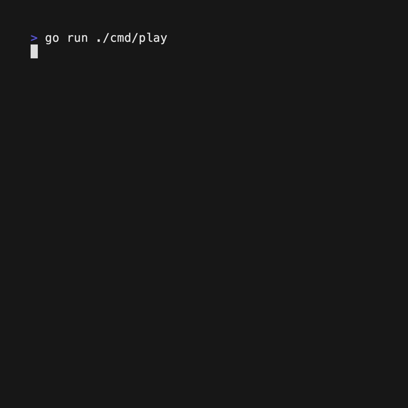

# Damka

Russian checkers (шашки) with an AI.

### [Play the game](https://medv.io/шашки/)

## Features

- Russian checkers rules
- AI with minimax algorithm and alpha-beta pruning
- Endgame database (optional)
- Neural network position evaluation
