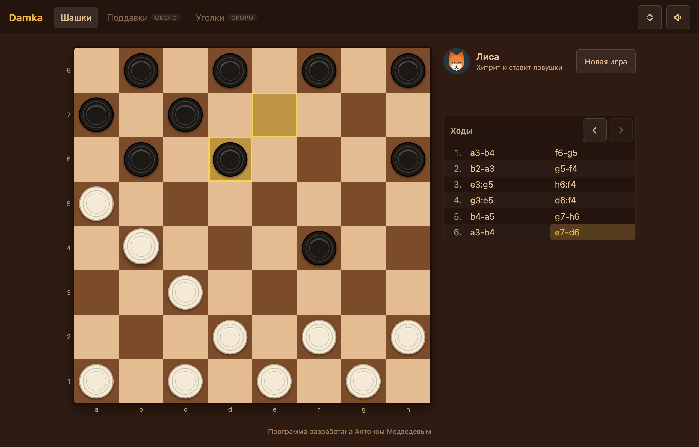
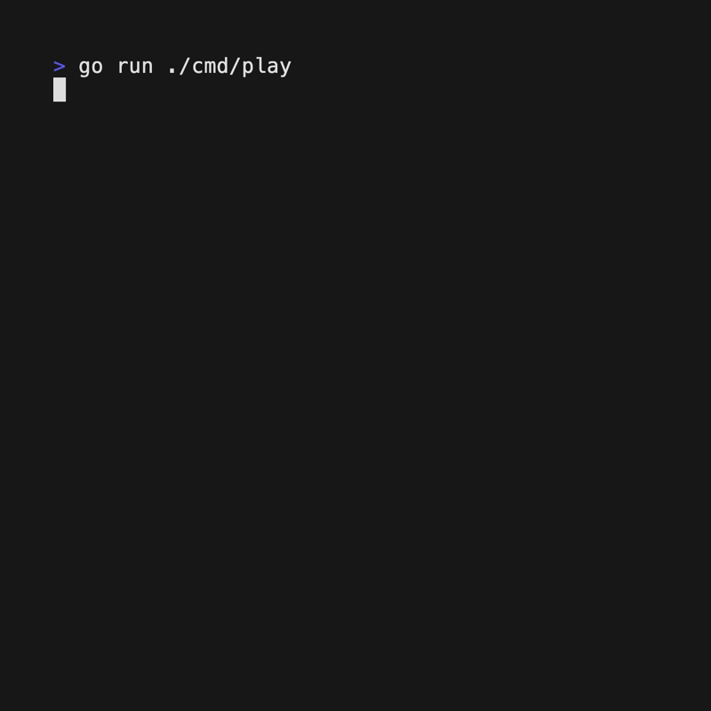

# Damka

Russian checkers (шашки) in the browser: a bitboard engine, an alpha-beta
search in a worker, and five computer opponents.

### [Play the game](https://antonmedv.github.io/damka/)

**Game**:

**Training**:

## Features

- Russian checkers rules: flying kings, mandatory captures, and the 30-ply draw
- Alpha-beta search with iterative deepening, transposition table, and capture search, running in a Web Worker

## References

- [Russian draughts](https://en.wikipedia.org/wiki/Russian_draughts)
- The earlier Go implementation, with an endgame database and a neural
  network evaluation, lives on the
  [go-version](https://github.com/antonmedv/damka/tree/go-version) branch

# License

[MIT](LICENSE)
